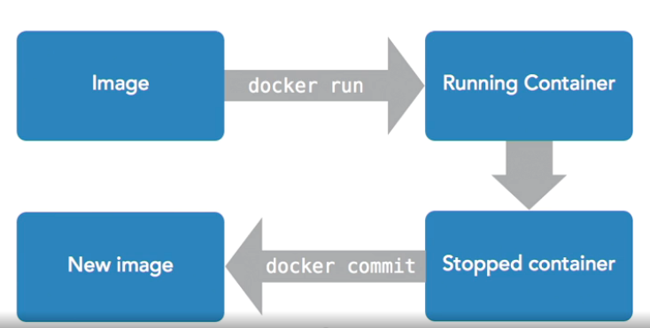

`docker images` -- list docker images

`docker run -ti ubuntu:latest bash` -- run the docker

`docker ps` -- list active dockers

`docker ps -l` -- show last exited container

* `docker ps -l` -- show last exited container
* copy ID of the last exited container
* `docker commit ${ID}` -- create new image, this will return sha, need to copy
* `docker tag ${sha} <New Name>` -- to give a name to the image

This can be achieved by one command
* `docker commit <image name> <new image name>`

`docker run --rm ...` -- after completing run, docker will remove the container, instead of manually
typing `docker rm <container_name>`

`docker run -ti ubuntu bash -c "sleep 3; echo all done"` -- for executing more than one commands

---

`docker run -d -ti ubuntu bash` -- for detached run

`docker ps` -- take name

`docker attach ${name}` -- return back to the session

`ctrl+pq` -- jump away from the session. Detach the session

---

`docker ps` -- take the container name
`docker exec -ti ${name}` -- attach terminal to running container

source: [LinedIn learning](https://www.linkedin.com/learning/learning-docker-2018/the-docker-flow-images-to-containers?u=2113185)
