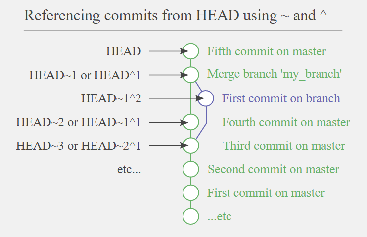

# Git cheatsheet

Resources used but not limited to.

- https://www.linkedin.com/learning/git-essential-training-the-basics/
- https://www.linkedin.com/learning/git-intermediate-techniques/

gitignore: https://github.com/github/gitignore

## Terminology
- Version Control System (VCS)
- Source Code Management (SCM)

## Data Integrity
Git supports data integrity. You can't change/modify older commits (only the latest you can),
because it keeps the parent commit's hash in commit's metadata.

## History behind git
<details>
  <summary> Click to expand! </summary>

1. Source Code Control System (SCCS)
    - 1972: closed source, free with Unix
    - Stored original version and sets of changes
    - Single user single file
    
2. Revision Control System (RCS)
    - 1982: open source
    - Stored the latest version and sets of changes
    - Single user single file
    
3. Concurrent Version System
    - 1986 - 1990: open source
    - Multiple file, entire project
    - Multi-user repositories
    - Version N of some file
    
4. Apache Subversion (SVN)
    - 2000: open source
    - Track text and images 
    - Track file changes collectively
    - Does snapshots of directory
    - Having a file in revision N
    
5. BitKeeper SCM
    - Distributed Version Control
    - Close Source
    - "Community" free
    - Used for source code of the Linux Kernel from 2002-2005
    - April 2005: the "Community" version was not free anymore
    
6. Git was born
    - April 2005
    - Created by Linus Torvalds
    
## Distributed Version Control

- Local
- Remote
  
   ### Advantages
   - No need to communicate with a central server
   - Faster
   - No network access required
   - Encourages participation and forking projects
   - Developers can work independently
   - Submit change sets for inclusion or rejection

</details>

## Concepts
<details>
<summary> 
The three trees
</summary>

**Working** ⇨ `git add` ⇨ **Staging index** ⇨ `git commit` ⇨ **Repository**

</details>

<details>
<summary>
Difference between HEAD~ (tilda) and HEAD^ (caret)
</summary>

```text
ref~ is shorthand for ref~1 and means the commit's first parent. 
ref~2 means the commit's first parent's first parent. 
ref~3 means the commit's first parent's first parent's first parent. And so on.
```

```text
ref^ is shorthand for ref^1 and means the commit's first parent. 
But where the two differ is that ref^2 means the commit's second parent 
(remember, commits can have two parents when they are a merge).
```

      The ^ and ~ operators can be combined.


[Reference](https://stackoverflow.com/questions/2221658/whats-the-difference-between-head-and-head-in-git)
</details>

<details>
<summary> git reset vs revert vs checkout </summary>

| Command      |     Scope     |                                                      Common use cases |
|:-------------|:-------------:|----------------------------------------------------------------------:|
| git reset    | Commit level  | Discard commits in a private branch or throw away uncommitted changes |
| git reset    |  File level   |                                                        Unstage a file |
| git checkout | 	Commit-level |                     	Switch between branches or inspect old snapshots |
| git checkout |  	File-level  |                             	Discard changes in the working directory |
| git revert 	 | Commit-level  |                                      	Undo commits in a public branch |
| git revert 	 |  File-level   |                                                                	(N/A) |


</details>

## Basic Commands
<details>
  <summary> git diff </summary>

>     git diff
> + Difference between **working** and **staging** trees, if **staging** index exists
> + Difference between **working** and **repository** trees, if **staging** index does not exist.


>     git diff --staged
> Difference between **staging** and **repository** trees
> 
> Here we can use `--cached` instead of `--staged` 

>     git diff --color-words
> Show colorized word difference, instead of line difference (default)


>     git diff <commit_hash_1>..<commit_hash_2>
> Difference between two commits. 
>
> ---
>     git diff <commit_hash_1>..HEAD
> In place of <commit_hash_2> can be used HEAD, if we want to compare with the latest commit

>     -S Enter
> Switch text wrapping


</details>

---

<details>
  <summary> git log </summary>

>     git log
> Show commit log

>     git log -n 5
> Show first 5 commits

>     git log --since=2020-05-22 --until=2021-06-15
> Show commits that are between two dates. You can use it also seperately

>     git log --author="Vardan"
> Show commits of specific author

>     git log --grep="text"
> Show filtered commits according to commit message
> 
> In place of the value parameter you can also write regular expression

>     git log --oneline
> Show commits each in one line


</details>

---

<details>
  <summary> git show </summary>

>       git show <commit_hash>
> Show the diff of the commit
> 


</details>

---

<details>
  <summary> git commit </summary>

>       git commit -a
> Commit without staging, but must be tracked files

>       git commit --amend -m "your text here"
> Modify the latest commit. Command will override the commit message.

</details>

---

<details>
  <summary> git checkout </summary>

>       git checkout -- file.txt
> UNDO changes of `file.txt` file in the working tree
> 
> ---
>       git checkout -- .
> UNDO all changes in the working tree
> 
> ---
>       git checkout <commit_hash> -- file.txt
> Retrieve  `file.txt` from the snapshot
> 

</details>

---

<details>
  <summary> git reset </summary>

>       git reset HEAD file.txt
> UNDO changes of `file.txt` file in the staging tree (un-stage the file)
> 
> ---
>       git reset HEAD .
>
>       git reset
> UNDO all changes in the staging tree (un-stage files)
> 
> ---
>       git reset --soft HEAD~1
> Remove last commit from the history and keep in staging
> 
>       git reset --mixed HEAD~1
> Remove last commit from the history and keep in working
> 
>       git reset --hard HEAD~1
> Remove last commit from the history and do not keep anywhere
>       
</details>

---

<details>
<summary>
git restore
</summary>

      git restore file
Restores (UNDO) changes of the file done in working tree 

      git restore --staged file
Restores (UNDO) changes of the file done in staging tree 

git-restore is a tool to revert non-committed changes. 

</details>

---
<details>
  <summary> git revert </summary>

>       git revert <commit_hash>
> UNDO/revert/reverse the commit. It will make a new commit.

</details>

---

<details>
  <summary> git clean </summary>

>       git clean -n
> Shows untracked files to remove
> 
>       git clean -f
> Removes untracked files

</details>

---

<details>
  <summary> git config </summary>

There are three types of configuration scopes in git

1. System level (`/etc/gitconfig`)
   - `git config --system`
2. User level (`~/.gitconfig`)
      - `git config --global`
3. Project level (`Project/.git/config`)
   - `git config


>       git config --global core.excludesfile ~/.gitignore_global
> Globally ignore files
> 
>       git config --global user.name "Name Surname"
> Sets the username
> 
>       git config --global user.email "user@example.com"
> Sets the email 
> 
>       git config --global core.editor "vim"
> Sets the editor 
> 
>       git config --global color.ui true
> Sets the color 
>     
>     git config --global alias.pushd "push -u origin HEAD"
> Define new alias for setting upstream
> 
> 
</details>

---

<details>
    <summary> git rm </summary>

>       git rm --cached file.txt
> Un-track staged file. Need to commit this change
> 
</details>

---

<details>
    <summary> git ls-tree </summary>

>       git ls-tree HEAD
> Show tracked files.
>
> In order to track empty directories, create there `.gitkeep` empty files, to make them non-empty
> 
</details>

---

<details>
    <summary> git mv </summary>

>       git mv file1.txt file2.txt
> Rename file1.txt -> file2.txt
>
> In order to track empty directories, create there `.gitkeep` empty files, to make them non-empty
> 
> You can achieve renaming of the file without `mv` command by the following way
> 
> 1. os remove committed file
> 2. add new file with the same content ( > 50% similarity)
> 3. git rm os removed file
> 3. git status will show renaming
</details>


---

<details>
    <summary> git tag </summary>

> Tag in a git is a named reference to a commit, it makes it easy to find the commit later on.
> 
> Most often tags are used to mark releases (v1.0, v1.1, v2.0, ...)
>
> Usually tags are named using Semantic Versioning like v"major"."minor"."patch"
>    - major : is a version number where you introduced breaking modifications (modifications of your new version are NOT compatible with previous versions);
>    - minor : is a version number that is compatible with previous versions.
>    - patch : is an increment for a bug fix or a patch fix done on your software.
>
> Git supports two types of tags: **lightweight** and **annotated**.
>
> Lightweight tags are just a pointers to a specific commits.
>
> Annotated tags are stored as full objects in git.
>
> They have:
>    - Checksum
>    - Tagger name, email
>    - Tagging date
>    - Message
>
>
>       git tag # or -l or --list
>    List of local tags
>
>       git tag -l "v.*"
>    List all tags that starts with "v."
>   
>       git tag -n
>    List tags and messages
>
>       git tag v1.0
>    Create a lightweight tag on HEAD
>
>       git tag -a v1.1 -m "my new version 1.1"
>    Create an annotated tag on HEAD
>
>       git tag -a key_feature -m "Some information" 6c8fc6e
>    Tag previous commit
>
>       git push origin v1.0
>    Push v1.0 tag to remote.
>
>       git push --tags
>    Push all tags to remote
>
>       git push -d origin v1.0
>    Delete tag from remote
>
>       git push origin :v1.0
>    Another way of deleting tag from remote
>
>       git tag -d v1.0
>    Delete tag from local
>      
>       git fetch --prune --prune-tags 
>    Syncing remote tags with local (will remove local tags if not found in remote)
>
>       git checkout -b quick_fix v1.0
>    Checkout to the tag with creating a branch
>
>       git checkout v1.0
>    If you checkout tag without creating branch, you'll enter Detached HEAD mode.
>      
>       git fetch --tags
>    Fetch tags from remote
>
</details>

---

<details>
    <summary> git branch </summary>

      git branch --merged
   All the commits that are in the listed branches are also in the current branch

      git branch -d feature
   Will delete feature branch, if it has been merged into the current branch, otherwise will  raise message

      git branch -D feature
   Delete feature branch (Delete branch that has not been merged yet)

      git push origin :feature
   Delete remote feature branch

      git push -d origin feature  # --delete
   Delete remote feature branch

   --- 

      git branch -m new_branch_name
   Rename local branch name

      git push origin :old_branch_name new_branch_name
   Change branch name in remote

      git push -u origin new_branch_name
   Set the upstream for new branch

      git push -u origin HEAD
   Alternatively pushing to HEAD is equivalent to pushing to remote branch having the same 
   name as your current name

   ---

      git branch -vv
   Show remote tracking branches

</details>

---

<details>
    <summary> git fetch </summary>
      
   There are three kind of branches in git.
   
   1. Remote branch feature
   2. Local snapshot of the remote branch (origin/feature), also called **remote tracking branch**
   3. Local branch feature

   Stale branch is a remote-tracking branch that no longer tracks anything, because the actual branch in the
   remote repository has been deleted. This can happen if someone deleted remote branch.

      git remote prune origin
   Delete stale remote-tracking branches. Possible to add `--dry-run` to run "test-delete"

      git fetch -p  # --prune
   Delete stale remote-tracking branches (fetch & prune)
   
</details>
